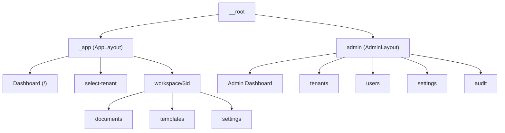

# UI Map - Web Client

Documentacion de referencia rapida para la estructura UI del proyecto.

---

## Sitemap



---

## Rutas

| Ruta | Layout | Permisos | Estado |
|------|--------|----------|--------|
| `/` | AppLayout | Auth | OK |
| `/select-tenant` | - | Auth | OK |
| `/workspace/$id` | AppLayout > WorkspaceLayout | Auth | OK |
| `/workspace/$id/documents` | WorkspaceLayout | Auth | Placeholder |
| `/workspace/$id/templates` | WorkspaceLayout | Auth | Placeholder |
| `/workspace/$id/settings` | WorkspaceLayout | WORKSPACE_UPDATE | Placeholder |
| `/admin` | AdminLayout | ADMIN_ACCESS | Placeholder |
| `/admin/tenants` | AdminLayout | SYSTEM_TENANTS_VIEW | OK |
| `/admin/users` | AdminLayout | SYSTEM_USERS_VIEW | OK |
| `/admin/settings` | AdminLayout | SYSTEM_SETTINGS_VIEW | Coming Soon |
| `/admin/audit` | AdminLayout | SYSTEM_AUDIT_VIEW | Coming Soon |

---

## Layouts

### AppLayout
`src/components/layout/AppLayout.tsx`

```
+------------------+-------------------------------------------+
| AppSidebar       | Header                                    |
| (colapsable)     | [Console] [Tenant] / [Workspace]  [User]  |
|                  +-------------------------------------------+
| - Organizations  |                                           |
| - Workspaces     |            <Outlet />                     |
| - Members        |                                           |
| - Settings       |                                           |
+------------------+-------------------------------------------+
```

### AdminLayout
`src/components/layout/AdminLayout.tsx`

```
+------------------+-------------------------------------------+
| AdminSidebar     | Header                                    |
| (purpura)        | [Console] Admin Console          [User]   |
|                  +-------------------------------------------+
| - Dashboard      |                                           |
| - Tenants        |            <Outlet />                     |
| - Users          |                                           |
| - Settings       |                                           |
| - Audit          |                                           |
+------------------+-------------------------------------------+
```

### WorkspaceLayout
`src/routes/_app/workspace/$workspaceId.tsx`

```
+--------------------------------------------------------+
| Workspace Name                                         |
| TYPE                                                   |
+--------------------------------------------------------+
| [Documentos] [Plantillas] [Configuracion*]             |
+--------------------------------------------------------+
|                                                        |
|                    <Outlet />                          |
|                                                        |
+--------------------------------------------------------+
* Solo visible con permiso WORKSPACE_UPDATE
```

---

## Componentes Comunes

| Componente | Ubicacion | Proposito |
|------------|-----------|-----------|
| PermissionGuard | `components/common/` | Render condicional por permisos |
| UserMenu | `components/common/` | Dropdown: tema, idioma, logout |
| WorkspaceTabs | `components/common/` | Tabs: Docs, Templates, Config |
| ConsoleSwitch | `components/common/` | Toggle Admin/App console |
| TenantSelector | `features/tenants/` | Combobox seleccion de tenant |
| ThemeToggle | `components/common/` | Ciclo light/dark/system |
| LanguageSelector | `components/common/` | Selector EN/ES |

---

## Features

| Feature | Ubicacion | Componentes | APIs |
|---------|-----------|-------------|------|
| auth | `features/auth/` | AuthProvider | recordAccess |
| tenants | `features/tenants/` | TenantSelector, CreateTenantDialog | list, search, create |
| workspaces | `features/workspaces/` | CreateWorkspaceDialog | list, search, get, create |
| editor | `features/editor/` | Editor, EditorToolbar | - |
| admin | `features/admin/` | - | listSystemUsers, revokeRole |
| documents | `features/documents/` | - (types only) | - |

---

## Stores (Zustand)

| Store | Estado | Persistencia |
|-------|--------|--------------|
| `auth-store` | token, systemRoles | localStorage |
| `app-context-store` | currentTenant, currentWorkspace | localStorage |
| `theme-store` | theme (light/dark/system) | localStorage |

### auth-store
```typescript
token: string | null
systemRoles: UserRole[]
isAuthenticated(): boolean
isSuperAdmin(): boolean
canAccessAdmin(): boolean
```

### app-context-store
```typescript
currentTenant: Tenant | null
currentWorkspace: Workspace | null
setTenant(tenant): void
setWorkspace(workspace): void
isSystemContext(): boolean
```

---

## RBAC (Permisos)

### Niveles de Rol

| Nivel | Roles |
|-------|-------|
| System | SUPERADMIN, PLATFORM_ADMIN |
| Tenant | OWNER, ADMIN |
| Workspace | OWNER, ADMIN, EDITOR, OPERATOR, VIEWER |

### Permisos por Rol de Workspace

| Permiso | OWNER | ADMIN | EDITOR | OPERATOR | VIEWER |
|---------|:-----:|:-----:|:------:|:--------:|:------:|
| WORKSPACE_VIEW | x | x | x | x | x |
| WORKSPACE_UPDATE | x | x | - | - | - |
| WORKSPACE_ARCHIVE | x | - | - | - | - |
| MEMBERS_* | x | x | - | - | - |
| CONTENT_CREATE | x | x | x | - | - |
| CONTENT_EDIT | x | x | x | - | - |
| CONTENT_DELETE | x | x | - | - | - |
| VERSION_PUBLISH | x | x | - | - | - |

---

## Flujo de Autenticacion

```
1. Root (__root.tsx)
   |-- Admin route? --> Continua
   |-- Tiene tenant? --> Continua
   \-- No --> Redirect /select-tenant

2. Select Tenant
   |-- SuperAdmin? --> Tabla de todos los tenants
   \-- Usuario normal --> Cards de mis tenants

3. Dashboard (/)
   \-- Grid de workspaces con busqueda

4. Workspace (/$id)
   \-- Tabs: Documentos | Plantillas | Config
```

---

## Headers HTTP (Automaticos)

El api-client inyecta automaticamente:

```
Authorization: Bearer {token}
X-Tenant-ID: {currentTenant.id}
X-Workspace-ID: {currentWorkspace.id}
```

---

## Variables de Entorno

```bash
VITE_API_URL              # Backend API (default: http://localhost:8080/api/v1)
VITE_KEYCLOAK_URL         # Keycloak server
VITE_KEYCLOAK_REALM       # Keycloak realm
VITE_KEYCLOAK_CLIENT_ID   # OAuth client ID
VITE_USE_MOCK_AUTH=true   # Bypass Keycloak (dev only)
```

---

## Path Aliases

`@/` --> `./src/`

---

## Archivos Clave

| Tipo | Ubicacion |
|------|-----------|
| Rutas | `src/routes/` |
| Route Tree (gen) | `src/routeTree.gen.ts` |
| Layouts | `src/components/layout/` |
| Componentes | `src/components/common/` |
| Features | `src/features/` |
| Stores | `src/stores/` |
| Permisos | `src/features/auth/rbac/rules.ts` |
| API Client | `src/lib/api-client.ts` |
| i18n | `public/locales/{en,es}/` |
