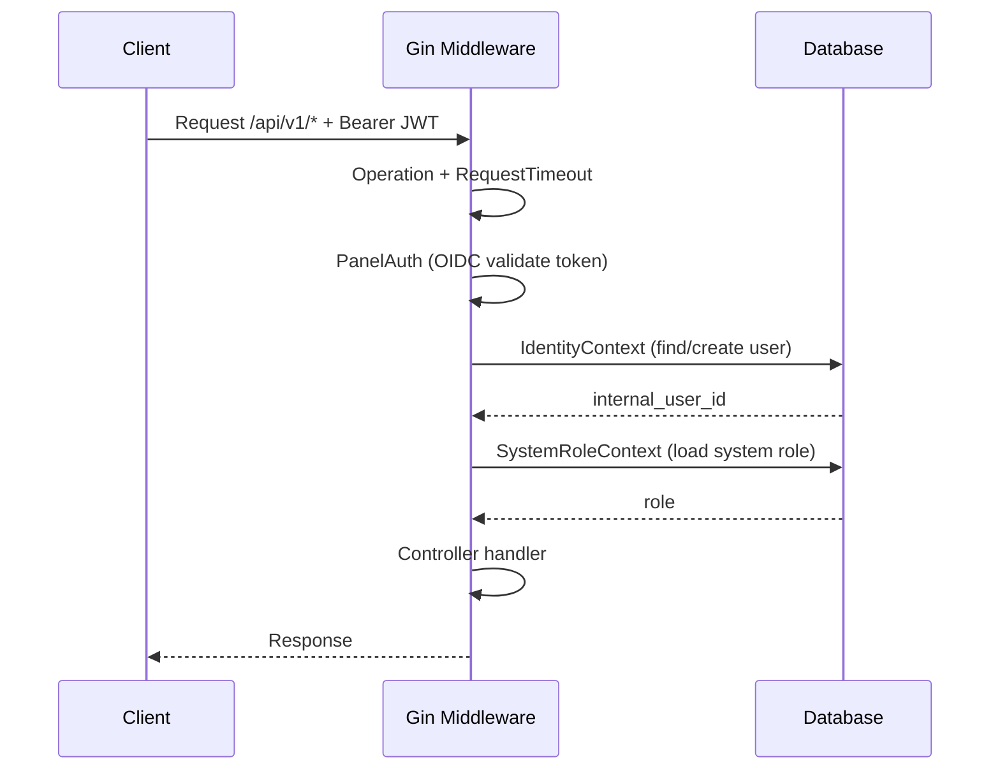
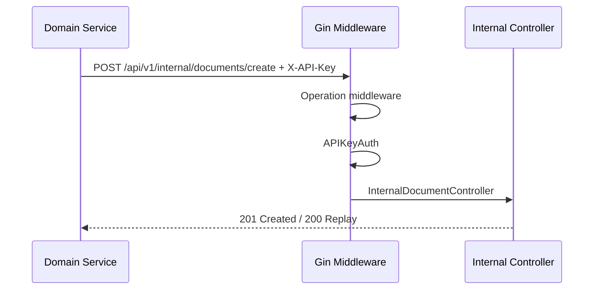
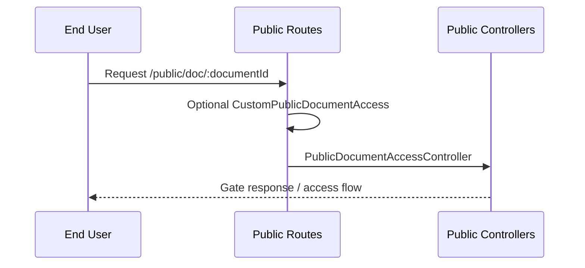

# Authentication Guide

## Overview

doc-assembly uses different access controls depending on the route group:

| Mode | Route Scope | Auth Middleware | Identity Lookup |
|---|---|---|---|
| Panel OIDC | `/api/v1/*` (panel routes) | `PanelAuth` | Yes (DB via `IdentityContext`) |
| Internal API Key | `/api/v1/internal/*` | `APIKeyAuth` | No |
| Public Access | `/public/*` | None by default, optional custom middleware for `/public/doc/:id` | No |
| Dummy (dev only) | `/api/v1/*` (panel routes) | `DummyAuth` + `DummyIdentityAndRoles` | No |

---

## Architecture

### Auth Config Structure

```yaml
auth:
  panel:
    name: keycloak
    discovery_url: https://kc.example.com/realms/myrealm
    issuer: https://kc.example.com/realms/myrealm
    jwks_url: https://kc.example.com/realms/myrealm/protocol/openid-connect/certs
    audience: doc-engine
    client_id: doc-engine-frontend
```

### Key Files

| File | Purpose |
|---|---|
| `internal/adapters/primary/http/middleware/jwt_auth.go` | OIDC token validation (`PanelAuth`, `MultiOIDCAuth`) |
| `internal/adapters/primary/http/middleware/dummy_auth.go` | Development bypass auth and identity |
| `internal/adapters/primary/http/middleware/apikey_auth.go` | Internal API key verification |
| `internal/adapters/primary/http/middleware/identity_context.go` | User sync/lookup in DB |
| `internal/adapters/primary/http/middleware/system_context.go` | System role load |
| `internal/adapters/primary/http/middleware/custom_public_document_access.go` | Optional custom auth for `/public/doc/:documentId` |
| `internal/infra/server/http.go` | Route groups + middleware wiring |
| `internal/infra/config/discovery.go` | OIDC discovery |

---

## Flow 1: Panel Authentication (Production)

Used for panel endpoints under `/api/v1/*` with full identity context.



### Token Validation Detail

`PanelAuth` delegates to `MultiOIDCAuth` with the panel provider. Validation flow:

1. Extract bearer token.
2. Parse issuer without signature validation.
3. Match issuer against configured provider(s).
4. Validate signature and claims via JWKS.
5. Store user claims in Gin context.

---

## Flow 2: Internal API Key Authentication

Used for service-to-service routes under `/api/v1/internal/*`.



---

## Flow 3: Public Access

Public signing/document routes are not protected by OIDC:

- `/public/doc/:documentId`
- `/public/doc/:documentId/request-access`
- `/public/sign/:token`
- Other `/public/*` flow endpoints

If a custom public document access authenticator is registered, it is applied only to `/public/doc/:documentId`.



---

## Flow 4: Dummy Authentication (Development)

Activated when no panel OIDC provider is configured.

```go
func (a *AuthConfig) IsDummyAuth() bool {
    return a.GetPanelOIDC() == nil
}
```

Behavior on panel routes:

1. `DummyAuth` injects fixed user claims.
2. `DummyIdentityAndRoles` injects internal user ID and `SUPERADMIN`.
3. Request continues without external IdP calls.

---

## Flow 5: OIDC Discovery

Runs during config load. If `discovery_url` is defined, discovery fetches OIDC metadata and fills missing fields such as `issuer`, `jwks_url`, and endpoints.

Key behavior:

- Non-fatal logging on discovery issues.
- Existing explicit config values are not overwritten.
- 10-second timeout per discovery request.

---

## Route Groups and Auth Summary

| Route Group | Auth |
|---|---|
| `/health`, `/ready`, `/swagger/*`, `/api/v1/config` | None |
| `/api/v1/internal/*` | `APIKeyAuth` |
| `/api/v1/*` panel routes | `DummyAuth` OR `PanelAuth + IdentityContext + SystemRoleContext` |
| `/public/*` | None (optional custom middleware on `/public/doc/:documentId`) |
| `/webhooks/*` | Provider-specific controller handling |

---

## Client Config Endpoint

`GET /api/v1/config` exposes non-sensitive auth config for frontend startup:

- `dummyAuth`
- `basePath`
- `panelProvider` (name, issuer, endpoints, client ID)

---

## Environment Variables

| Variable | Description | Required |
|---|---|---|
| `DOC_ENGINE_AUTH_DISCOVERY_URL` | OIDC discovery endpoint | No |
| `DOC_ENGINE_AUTH_ISSUER` | Expected JWT issuer | Yes (OIDC mode) |
| `DOC_ENGINE_AUTH_JWKS_URL` | JWKS URL | Yes (OIDC mode) |
| `DOC_ENGINE_AUTH_AUDIENCE` | Expected audience | No |
| `DOC_ENGINE_AUTH_CLIENT_ID` | Frontend OIDC client ID | No |
| `DOC_ENGINE_INTERNAL_API_ENABLED` | Enables internal API routes | No |
| `DOC_ENGINE_INTERNAL_API_KEY` | Internal API key | Yes (if internal API enabled) |

---

## Testing Notes

Some integration tests use `MultiOIDCAuth` with an empty provider list to parse test tokens without signature validation. This is test-only behavior and not used in production wiring.
