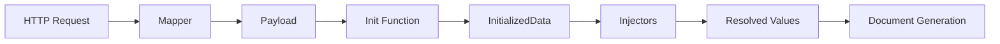
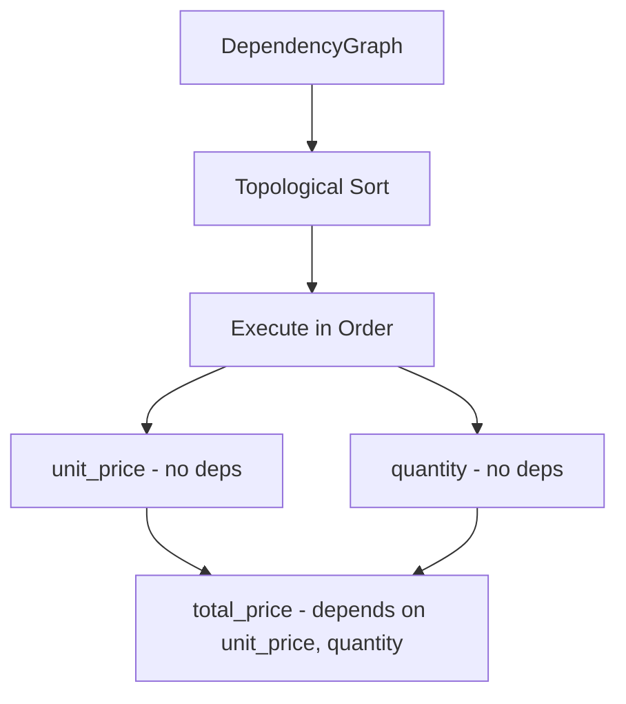
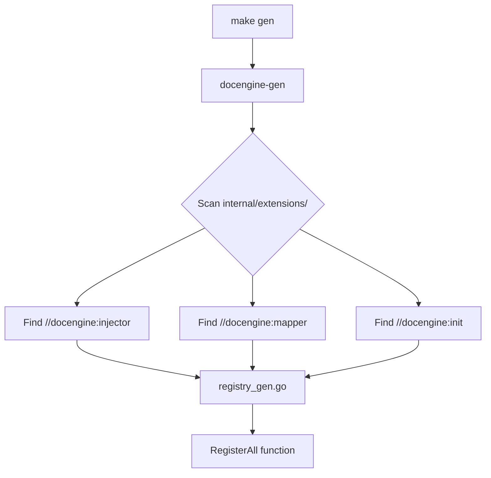

# Extensibility Guide

This guide explains how to extend Doc Engine with custom **injectors**, **mappers**, and **init functions** for document generation.

## Overview

The extensibility system allows you to:
- **Injectors**: Resolve dynamic values from external sources (CRM, databases, APIs)
- **Mapper**: Parse incoming request payloads into typed structures
- **Init Function**: Load shared data once before all injectors run



## Quick Start

1. Create your component in `internal/extensions/`
2. Add the appropriate marker comment (`//docengine:injector`, `//docengine:mapper`, or `//docengine:init`)
3. Implement the required interface
4. Run `make gen` to regenerate the registry
5. Run `make build` to compile

## Directory Structure

```
internal/extensions/
├── init.go                    # Init function (//docengine:init)
├── registry_gen.go            # Auto-generated registry (DO NOT EDIT)
├── injectors/
│   ├── example_injector.go    # Injectors (//docengine:injector)
│   └── datetime/              # Subdirectory by domain
│       ├── date_now.go
│       └── time_now.go
└── mappers/
    └── example_mapper.go      # Mapper (//docengine:mapper)
```

### Organizing Injectors by Domain

Injectors can be organized in subdirectories by domain. The code generator **recursively scans** all subdirectories under `injectors/`:

```
internal/extensions/injectors/
├── crm/                       # CRM domain
│   ├── client_name.go
│   └── client_email.go
├── billing/                   # Billing domain
│   ├── invoice_total.go
│   └── payment_date.go
├── datetime/                  # Date/time domain
│   ├── date_now.go
│   └── time_now.go
└── example_injector.go        # Root level also works
```

Each subdirectory is a separate Go package. The generated `registry_gen.go` will automatically:
- Import each package (`datetime`, `crm`, `billing`)
- Register injectors with their package prefix (`&datetime.DateNowInjector{}`)

**Important:** Each subdirectory must have its own `package` declaration matching the folder name:

```go
// File: internal/extensions/injectors/crm/client_name.go
package crm  // Must match folder name

//docengine:injector
type ClientNameInjector struct{}
```

---

## Injectors

Injectors resolve dynamic values that are inserted into document templates. Each injector has a unique code that maps to a template variable.

### Interface

```go
type Injector interface {
    // Code returns the unique identifier (maps to i18n and template variables)
    Code() string

    // Resolve returns the resolution function and dependencies
    // Dependencies are codes of other injectors that must run first
    Resolve() (ResolveFunc, []string)

    // IsCritical indicates if errors should stop document generation
    IsCritical() bool

    // Timeout returns the timeout (0 = default 30s)
    Timeout() time.Duration

    // DataType returns the type of value (string, number, bool, time)
    DataType() entity.ValueType

    // DefaultValue returns fallback value if resolution fails (nil = no default)
    DefaultValue() *entity.InjectableValue

    // Formats returns format configuration (nil = no formatting)
    Formats() *entity.FormatConfig
}

type ResolveFunc func(ctx context.Context, injCtx *entity.InjectorContext) (*entity.InjectorResult, error)
```

### Creating an Injector

```go
package injectors

import (
    "context"
    "time"

    "github.com/rendis/doc-assembly/core/internal/core/entity"
    "github.com/rendis/doc-assembly/core/internal/core/port"
)

// ClientNameInjector resolves the client name from CRM.
//
//docengine:injector
type ClientNameInjector struct{}

func (i *ClientNameInjector) Code() string {
    return "client_name"
}

func (i *ClientNameInjector) Resolve() (port.ResolveFunc, []string) {
    return func(ctx context.Context, injCtx *entity.InjectorContext) (*entity.InjectorResult, error) {
        // Access init data (loaded in GlobalInit)
        initData := injCtx.InitData().(*extensions.InitializedData)

        // Return the resolved value
        return &entity.InjectorResult{
            Value: entity.StringValue(initData.ClientInfo.Name),
        }, nil
    }, nil // no dependencies
}

func (i *ClientNameInjector) IsCritical() bool {
    return true // stop if client name can't be resolved
}

func (i *ClientNameInjector) Timeout() time.Duration {
    return 10 * time.Second
}

func (i *ClientNameInjector) DataType() entity.ValueType {
    return entity.ValueTypeString
}

func (i *ClientNameInjector) DefaultValue() *entity.InjectableValue {
    return nil // required field, no default
}

func (i *ClientNameInjector) Formats() *entity.FormatConfig {
    return nil // no formatting for plain strings
}
```

### Value Types

Injectors return typed values using `entity.InjectableValue`:

```go
entity.StringValue("text")           // string
entity.NumberValue(123.45)           // float64
entity.BoolValue(true)               // bool
entity.TimeValue(time.Now())         // time.Time
```

### Dependencies Between Injectors

Injectors can depend on other injectors. Dependencies are resolved using topological sort:

```go
func (i *TotalPriceInjector) Resolve() (port.ResolveFunc, []string) {
    return func(ctx context.Context, injCtx *entity.InjectorContext) (*entity.InjectorResult, error) {
        // Get value from another injector
        unitPrice, _ := injCtx.GetResolved("unit_price")
        quantity, _ := injCtx.GetResolved("quantity")

        total := unitPrice.(float64) * quantity.(float64)
        return &entity.InjectorResult{
            Value: entity.NumberValue(total),
        }, nil
    }, []string{"unit_price", "quantity"} // dependencies
}
```



### i18n for Injectors

Add translations in `settings/injectors.i18n.yaml`:

```yaml
client_name:
  name:
    en: "Client Name"
    es: "Nombre del Cliente"
  description:
    en: "The full name of the client from CRM"
    es: "El nombre completo del cliente desde el CRM"

total_price:
  name:
    en: "Total Price"
    es: "Precio Total"
  description:
    en: "Calculated total price with discounts"
    es: "Precio total calculado con descuentos"
```

The frontend retrieves these translations via the API to display user-friendly names in the template editor.

### Formatting

Injectors can specify format options that users can choose from. The `formatter` package provides built-in presets for common formatting needs.

#### Built-in Format Presets

| Preset | Default Format | Description |
|--------|---------------|-------------|
| `formatter.DateFormats` | `DD/MM/YYYY` | Date formats (31/12/2024, 2024-12-31, etc.) |
| `formatter.TimeFormats` | `HH:mm` | Time formats (14:30, 02:30 PM, etc.) |
| `formatter.DateTimeFormats` | `DD/MM/YYYY HH:mm` | Combined date and time |
| `formatter.NumberFormats` | `#,##0.00` | Number formatting with decimals |
| `formatter.CurrencyFormats` | `$#,##0.00` | Currency formatting |
| `formatter.PercentageFormats` | `#,##0.00%` | Percentage formatting |
| `formatter.PhoneFormats` | `+## # #### ####` | Phone number formatting |
| `formatter.RUTFormats` | `##.###.###-#` | Chilean RUT formatting |
| `formatter.BoolFormats` | `Yes/No` | Boolean display options |

#### Using Formatters in Injectors

```go
import "github.com/rendis/doc-assembly/core/internal/core/formatter"

//docengine:injector
type ContractDateInjector struct{}

func (i *ContractDateInjector) Code() string { return "contract_date" }

func (i *ContractDateInjector) DataType() entity.ValueType {
    return entity.ValueTypeTime
}

func (i *ContractDateInjector) DefaultValue() *entity.InjectableValue {
    return nil
}

func (i *ContractDateInjector) Formats() *entity.FormatConfig {
    return formatter.DateTimeFormats // use built-in preset
}

func (i *ContractDateInjector) Resolve() (port.ResolveFunc, []string) {
    return func(ctx context.Context, injCtx *entity.InjectorContext) (*entity.InjectorResult, error) {
        // Get the format selected by user (or use default)
        format := injCtx.SelectedFormat("contract_date")
        if format == "" {
            format = formatter.DateTimeFormats.Default
        }

        contractDate := time.Now()
        formatted := formatter.FormatTime(contractDate, format)

        return &entity.InjectorResult{
            Value: entity.StringValue(formatted),
            Metadata: map[string]any{
                "rawValue": contractDate,
                "format":   format,
            },
        }, nil
    }, nil
}
```

#### Formatter Utilities

```go
// Format time values
formatter.FormatTime(time.Now(), "DD/MM/YYYY")    // "31/12/2024"
formatter.FormatTime(time.Now(), "MMMM D, YYYY")  // "December 31, 2024"

// Format numbers
formatter.FormatNumber(1234.56, "#,##0.00")       // "1,234.56"
formatter.FormatNumber(1234.56, "$#,##0.00")      // "$1,234.56"

// Format booleans
formatter.FormatBool(true, "Yes/No")              // "Yes"
formatter.FormatBool(false, "Sí/No")              // "No"

// Format phone numbers
formatter.FormatPhone("56912345678", "+## # #### ####")  // "+56 9 1234 5678"

// Format Chilean RUT
formatter.FormatRUT("123456789", "##.###.###-#")  // "12.345.678-9"
```

#### Custom Format Configuration

You can create custom format configurations:

```go
func (i *MyInjector) Formats() *entity.FormatConfig {
    return &entity.FormatConfig{
        Default: "Custom Format A",
        Options: []string{
            "Custom Format A",
            "Custom Format B",
            "Custom Format C",
        },
    }
}
```

---

## Mapper

The mapper parses incoming HTTP request payloads. **Only ONE mapper is allowed** - if you need multiple document types, handle routing internally.

### Interface

```go
type RequestMapper interface {
    // Map parses the raw body and returns the payload
    Map(ctx context.Context, mapCtx *MapperContext) (any, error)
}

type MapperContext struct {
    ExternalID      string               // external ID from request
    TemplateID      string               // template to use
    TransactionalID string               // for traceability
    Operation       entity.OperationType // operation type
    Headers         map[string]string    // HTTP headers
    RawBody         []byte               // unparsed request body
}
```

### Creating a Mapper

```go
package mappers

import (
    "context"
    "encoding/json"
    "errors"

    "github.com/rendis/doc-assembly/core/internal/core/entity"
    "github.com/rendis/doc-assembly/core/internal/core/port"
)

// ContractPayload is the business-specific payload structure.
type ContractPayload struct {
    CustomerName string  `json:"customerName"`
    ProductID    string  `json:"productId"`
    Amount       float64 `json:"amount"`
    Quantity     int     `json:"quantity"`
}

// ContractMapper parses contract generation requests.
//
//docengine:mapper
type ContractMapper struct{}

func (m *ContractMapper) Map(ctx context.Context, mapCtx *port.MapperContext) (any, error) {
    var payload ContractPayload
    if err := json.Unmarshal(mapCtx.RawBody, &payload); err != nil {
        return nil, err
    }
    return payload, nil
}
```

### Internal Routing Pattern

If you need to handle multiple document types, route internally:

```go
func (m *MultiDocMapper) Map(ctx context.Context, mapCtx *port.MapperContext) (any, error) {
    // Determine document type from header or body
    docType := mapCtx.Headers["X-Document-Type"]

    switch docType {
    case "contract":
        return m.parseContract(mapCtx.RawBody)
    case "invoice":
        return m.parseInvoice(mapCtx.RawBody)
    default:
        return nil, fmt.Errorf("unknown document type: %s", docType)
    }
}
```

---

## Init Function

The init function runs **once before all injectors** and loads shared data. **Only ONE init function is allowed.**

### Creating an Init Function

In `internal/extensions/init.go`:

```go
package extensions

import (
    "context"

    "github.com/rendis/doc-assembly/core/internal/core/entity"
    "github.com/rendis/doc-assembly/core/internal/core/port"
)

// InitDeps contains dependencies injected by the DI system.
type InitDeps struct {
    CRMService    CRMService
    ConfigService ConfigService
}

// InitializedData contains data loaded once and shared with all injectors.
type InitializedData struct {
    ClientInfo  *ClientInfo
    ProductInfo *ProductInfo
    Config      *WorkspaceConfig
}

// GlobalInit loads shared data before injectors run.
//
//docengine:init
func GlobalInit(deps *InitDeps) port.InitFunc {
    return func(ctx context.Context, injCtx *entity.InjectorContext) (any, error) {
        // Load client from CRM
        client, err := deps.CRMService.GetClient(ctx, injCtx.ExternalID())
        if err != nil {
            return nil, fmt.Errorf("failed to load client: %w", err)
        }

        // Load workspace config
        config, err := deps.ConfigService.GetConfig(ctx, injCtx.WorkspaceID())
        if err != nil {
            return nil, fmt.Errorf("failed to load config: %w", err)
        }

        return &InitializedData{
            ClientInfo: client,
            Config:     config,
        }, nil
    }
}
```

### Accessing Init Data from Injectors

```go
func (i *MyInjector) Resolve() (port.ResolveFunc, []string) {
    return func(ctx context.Context, injCtx *entity.InjectorContext) (*entity.InjectorResult, error) {
        // Type assert to your InitializedData struct
        initData := injCtx.InitData().(*extensions.InitializedData)

        // Use the pre-loaded data
        return &entity.InjectorResult{
            Value: entity.StringValue(initData.ClientInfo.Name),
        }, nil
    }, nil
}
```

### Init vs Injectors

| Use Init For | Use Injectors For |
|--------------|-------------------|
| Data needed by multiple injectors | Single values |
| Expensive operations (API calls, DB queries) | Simple transformations |
| Authentication/authorization checks | Calculations |
| Loading configuration | Formatting |

---

## Code Generation

The `docengine-gen` tool scans for markers and generates `registry_gen.go`.



### Running Generation

```bash
make gen    # Generates Wire DI, Swagger docs, and extensions registry

make docengine-gen # Generates extensions registry
```

### Generated Output

```go
// Code generated by docengine-gen. DO NOT EDIT.

package extensions

func RegisterAll(injReg port.InjectorRegistry, mapReg port.MapperRegistry, deps *InitDeps) {
    // Global init (auto-discovered via //docengine:init)
    injReg.SetInitFunc(GlobalInit(deps))

    // Injectors (auto-discovered via //docengine:injector)
    injReg.Register(&injectors.ClientNameInjector{})
    injReg.Register(&injectors.TotalPriceInjector{})

    // Mapper (auto-discovered via //docengine:mapper)
    mapReg.Set(&mappers.ContractMapper{})
}
```

### Validation Rules

| Component | Limit | Error if Exceeded |
|-----------|-------|-------------------|
| `//docengine:injector` | Unlimited | - |
| `//docengine:mapper` | ONE | Build fails with error |
| `//docengine:init` | ONE | Build fails with error |

---

## Common Patterns

### Error Handling

```go
func (i *MyInjector) Resolve() (port.ResolveFunc, []string) {
    return func(ctx context.Context, injCtx *entity.InjectorContext) (*entity.InjectorResult, error) {
        value, err := fetchValue(ctx)
        if err != nil {
            // If IsCritical() returns true, this stops document generation
            // If false, the error is logged and the value is empty
            return nil, fmt.Errorf("failed to fetch value: %w", err)
        }
        return &entity.InjectorResult{Value: entity.StringValue(value)}, nil
    }, nil
}
```

### Context Values

Available from `InjectorContext`:

```go
injCtx.ExternalID()           // External identifier
injCtx.TemplateID()           // Template being used
injCtx.TransactionalID()      // For traceability
injCtx.Operation()            // Operation type
injCtx.Header("key")          // HTTP header value
injCtx.RequestPayload()       // Parsed payload from mapper
injCtx.InitData()             // Data from init function
injCtx.GetResolved("code")    // Value from another injector
injCtx.SelectedFormat("code") // Selected format for an injector
```

### Timeout Configuration

```go
func (i *SlowInjector) Timeout() time.Duration {
    return 60 * time.Second  // Override default 30s
}

func (i *FastInjector) Timeout() time.Duration {
    return 0  // Use default 30s
}
```

---

## Troubleshooting

### Build Error: Multiple Mappers

```
ERROR: Only ONE mapper is allowed. Found 2 mappers:
  - mappers.ContractMapper
  - mappers.InvoiceMapper
Remove extra //docengine:mapper markers or combine into one mapper.
```

**Solution:** Remove extra `//docengine:mapper` markers. Use internal routing if needed.

### Build Error: Multiple Init Functions

```
ERROR: Only ONE init function is allowed. Found 2:
  - extensions.GlobalInit
  - extensions.AnotherInit
Remove extra //docengine:init markers.
```

**Solution:** Keep only one function with `//docengine:init`.

### Missing i18n Translation

If an injector code has no translation, `GetName()` returns the code itself.

**Solution:** Add the translation to `settings/injectors.i18n.yaml`.

### Circular Dependencies

```
ERROR: circular dependency detected: injector_a -> injector_b -> injector_a
```

**Solution:** Refactor injectors to break the cycle. Consider moving shared logic to init.

### Import Cycle with extensions Package

```
import cycle not allowed: injectors -> extensions -> injectors
```

**Solution:** Don't import `extensions` directly in injectors. Use type assertion:

```go
// Instead of:
// initData := injCtx.InitData().(*extensions.InitializedData)

// Define a local interface or use the concrete type after cast
initData := injCtx.InitData()
if data, ok := initData.(*InitializedData); ok {
    // use data
}
```
