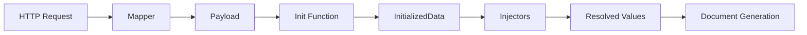

# Extensibility Guide

This guide explains how to extend doc-assembly with custom **injectors**, **mappers**, **init functions**, and **providers**.

## Overview

The extensibility system allows you to:
- **Injectors**: Resolve dynamic values from external sources (CRM, databases, APIs)
- **Mapper**: Parse incoming request payloads into typed structures
- **Init Function**: Load shared data once before all injectors run
- **Providers**: Custom authentication, signing, storage, and notifications



## Quick Start

1. Create your component in `extensions/injectors/`
2. Implement the `sdk.Injector` interface
3. Register it in `extensions/register.go` via `engine.RegisterInjector()`
4. Add i18n labels in `settings/injectors.i18n.yaml`
5. Run `make build`

## Project Structure

```
my-project/
├── main.go                        # Engine setup + Run()
├── extensions/
│   ├── register.go                # Register(engine) — all extensions registered here
│   └── injectors/
│       ├── client_name.go         # Custom injectors
│       └── datetime/              # Organize by domain
├── settings/
│   ├── app.yaml                   # Configuration
│   └── injectors.i18n.yaml        # Injector labels/descriptions
└── go.mod
```

---

## Injectors

Injectors resolve dynamic values inserted into document templates. Each injector has a unique code that maps to a template variable.

### Interface

All types are available via the `sdk` package:

```go
import "github.com/rendis/doc-assembly/core/sdk"

type Injector interface {
    Code() string                              // Unique identifier
    Resolve() (sdk.ResolveFunc, []string)       // Resolution function + dependencies
    IsCritical() bool                           // Stop generation on error?
    Timeout() time.Duration                     // 0 = default 30s
    DataType() sdk.ValueType                    // STRING, NUMBER, BOOL, TIME, TABLE, IMAGE, LIST
    DefaultValue() *sdk.InjectableValue         // Fallback if resolution fails (nil = no default)
    Formats() *sdk.FormatConfig                 // Format options (nil = no formatting)
}
```

### Creating an Injector

```go
package injectors

import (
    "context"
    "time"

    "github.com/rendis/doc-assembly/core/sdk"
)

type ClientNameInjector struct{}

func (i *ClientNameInjector) Code() string { return "client_name" }

func (i *ClientNameInjector) DataType() sdk.ValueType { return sdk.ValueTypeString }

func (i *ClientNameInjector) DefaultValue() *sdk.InjectableValue { return nil }

func (i *ClientNameInjector) Formats() *sdk.FormatConfig { return nil }

func (i *ClientNameInjector) Resolve() (sdk.ResolveFunc, []string) {
    return func(ctx context.Context, injCtx *sdk.InjectorContext) (*sdk.InjectorResult, error) {
        // Access init data (loaded by the Init function)
        initData := injCtx.InitData().(*InitializedData)

        return &sdk.InjectorResult{
            Value: sdk.StringValue(initData.ClientInfo.Name),
        }, nil
    }, nil // no dependencies
}

func (i *ClientNameInjector) IsCritical() bool       { return true }
func (i *ClientNameInjector) Timeout() time.Duration { return 10 * time.Second }
```

### Registering Injectors

In `extensions/register.go`:

```go
package extensions

import (
    "github.com/rendis/doc-assembly/core/sdk"
    "github.com/myorg/my-project/extensions/injectors"
)

func Register(engine *sdk.Engine) {
    engine.RegisterInjector(&injectors.ClientNameInjector{})
    engine.RegisterInjector(&injectors.TotalPriceInjector{})

    // engine.SetMapper(&mappers.ContractMapper{})
    // engine.SetInitFunc(myInitFunc)
}
```

### Value Types

```go
sdk.StringValue("text")           // string
sdk.NumberValue(123.45)           // float64
sdk.BoolValue(true)               // bool
sdk.TimeValue(time.Now())         // time.Time
sdk.TableValueData(tableValue)    // table data
sdk.ImageValue(imageData)         // image data
sdk.ListValueData(listValue)      // list data
```

### Dependencies Between Injectors

Injectors can depend on other injectors. Dependencies are resolved using topological sort:

```go
func (i *TotalPriceInjector) Resolve() (sdk.ResolveFunc, []string) {
    return func(ctx context.Context, injCtx *sdk.InjectorContext) (*sdk.InjectorResult, error) {
        unitPrice, _ := injCtx.GetResolved("unit_price")
        quantity, _ := injCtx.GetResolved("quantity")

        total := unitPrice.(float64) * quantity.(float64)
        return &sdk.InjectorResult{
            Value: sdk.NumberValue(total),
        }, nil
    }, []string{"unit_price", "quantity"} // must run after these
}
```

### i18n for Injectors

Add translations in `settings/injectors.i18n.yaml`:

```yaml
# Key must match Code() return value
client_name:
  label:
    en: "Client Name"
    es: "Nombre del Cliente"
  description:
    en: "The full name of the client from CRM"
    es: "El nombre completo del cliente desde el CRM"
```

`en` is required; other languages are optional (falls back to `en`).

### Formatting

Injectors can specify format options. The selected format is available via `injCtx.SelectedFormat()`:

```go
func (i *ContractDateInjector) Formats() *sdk.FormatConfig {
    return &sdk.FormatConfig{
        Default: "DD/MM/YYYY",
        Options: []string{"DD/MM/YYYY", "MM/DD/YYYY", "YYYY-MM-DD", "long"},
    }
}

func (i *ContractDateInjector) Resolve() (sdk.ResolveFunc, []string) {
    return func(ctx context.Context, injCtx *sdk.InjectorContext) (*sdk.InjectorResult, error) {
        format := injCtx.SelectedFormat("contract_date")
        if format == "" {
            format = "DD/MM/YYYY"
        }
        formatted := formatter.FormatTime(time.Now(), format)
        return &sdk.InjectorResult{Value: sdk.StringValue(formatted)}, nil
    }, nil
}
```

---

## Mapper

The mapper parses incoming HTTP request payloads. **Only ONE mapper is allowed.**

### Interface

```go
type RequestMapper interface {
    Map(ctx context.Context, mapCtx *sdk.MapperContext) (any, error)
}
```

### Creating a Mapper

```go
package mappers

import (
    "context"
    "encoding/json"

    "github.com/rendis/doc-assembly/core/sdk"
)

type ContractPayload struct {
    CustomerName string  `json:"customerName"`
    Amount       float64 `json:"amount"`
}

type ContractMapper struct{}

func (m *ContractMapper) Map(ctx context.Context, mapCtx *sdk.MapperContext) (any, error) {
    var payload ContractPayload
    if err := json.Unmarshal(mapCtx.RawBody, &payload); err != nil {
        return nil, err
    }
    return payload, nil
}
```

Register: `engine.SetMapper(&mappers.ContractMapper{})`

### MapperContext in Internal Create

For `POST /api/v1/internal/documents/create`, `mapCtx.RawBody` contains only the JSON from `payload` (not the full envelope).

Useful fields:
- `mapCtx.ExternalID`
- `mapCtx.TransactionalID`
- `mapCtx.TemplateVersionID`
- `mapCtx.DocumentTypeID`
- `mapCtx.TenantCode`
- `mapCtx.WorkspaceCode`
- `mapCtx.DocumentTypeCode`
- `mapCtx.Headers`

---

## Template Resolver (Internal Create)

Use a custom resolver when you need to choose the template version dynamically before the default 3-level fallback.

### Interface

```go
type TemplateResolver interface {
    Resolve(
        ctx context.Context,
        req *sdk.TemplateResolverRequest,
        adapter sdk.TemplateVersionSearchAdapter,
    ) (*string, error)
}
```

Resolver contract:
- Return `versionID` (`*string` non-nil): use that version.
- Return `nil, nil`: fallback to default resolver.
- Return `error`: abort request.

### Read-only Search Adapter

The resolver receives a read-only adapter:

```go
items, err := adapter.SearchTemplateVersions(ctx, sdk.TemplateVersionSearchParams{
    TenantCode:     req.TenantCode,
    WorkspaceCodes: []string{req.WorkspaceCode, "SYS_WRKSP"},
    DocumentType:   req.DocumentType,
})
```

### Registration

```go
engine.SetTemplateResolver(&resolvers.MyTemplateResolver{})
```

---

## Init Function

Runs **once before all injectors** and loads shared data. **Only ONE init function is allowed.**

```go
func Register(engine *sdk.Engine) {
    engine.SetInitFunc(func(ctx context.Context, injCtx *sdk.InjectorContext) (any, error) {
        client, err := crmService.GetClient(ctx, injCtx.ExternalID())
        if err != nil {
            return nil, fmt.Errorf("load client: %w", err)
        }
        return &InitializedData{Client: client}, nil
    })
}
```

Access from injectors: `injCtx.InitData().(*InitializedData)`

| Use Init For | Use Injectors For |
|---|---|
| Data needed by multiple injectors | Single values |
| Expensive operations (API calls) | Simple transformations |
| Auth checks | Calculations |

---

## Engine Extension Points

All extension points are set on the `sdk.Engine` instance:

```go
engine := sdk.New()

// Core extensibility
engine.RegisterInjector(&myInjector{})     // Multiple allowed
engine.SetMapper(&myMapper{})              // ONE only
engine.SetTemplateResolver(&myResolver{})  // Optional (internal create)
engine.SetInitFunc(myInitFunc)             // ONE only

// Providers (override defaults from config)
engine.SetSigningProvider(mySigningProvider)
engine.SetStorageAdapter(myStorageAdapter)
engine.SetNotificationProvider(myNotifier)
engine.SetWorkspaceInjectableProvider(myProvider)

// Customization
engine.SetDesignTokens(sdk.TypstDesignTokens{...})
engine.SetFrontendFS(myFS)                 // nil = no frontend
engine.SetI18nFilePath("settings/injectors.i18n.yaml")

// Middleware
engine.UseMiddleware(rateLimiter)          // All routes
engine.UseAPIMiddleware(tenantLogger)      // /api/v1/* only

// Lifecycle hooks
engine.OnStart(func(ctx context.Context) error { ... })
engine.OnShutdown(func(ctx context.Context) error { ... })

engine.Run()
```

---

## Context Values

Available from `InjectorContext`:

```go
injCtx.ExternalID()           // External identifier
injCtx.TemplateID()           // Template being used
injCtx.TransactionalID()      // For traceability
injCtx.Operation()            // Operation type (CREATE, RENEW, AMEND, etc.)
injCtx.Header("key")          // HTTP header value
injCtx.RequestPayload()       // Parsed payload from mapper
injCtx.InitData()             // Data from init function
injCtx.GetResolved("code")    // Value from another injector
injCtx.SelectedFormat("code") // Selected format for an injector
```

---

## Troubleshooting

### Missing i18n Translation

If an injector code has no translation, the raw code is displayed. Add the translation to `settings/injectors.i18n.yaml`.

### Circular Dependencies

```
ERROR: circular dependency detected: injector_a -> injector_b -> injector_a
```

Refactor injectors to break the cycle, or move shared logic to the init function.

### Injector Not Visible in API

Injectors must be **activated** via the admin panel (`/api/v1/system/injectables/:key/activate`) and **assigned** to workspaces before they appear in `GET /api/v1/content/injectables`.
