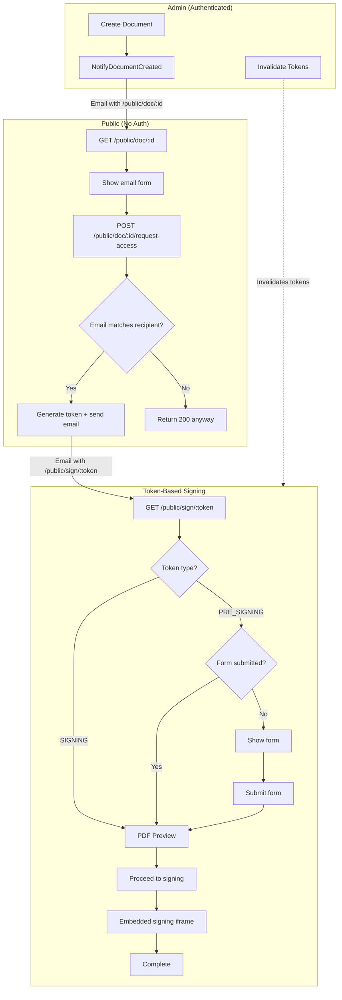
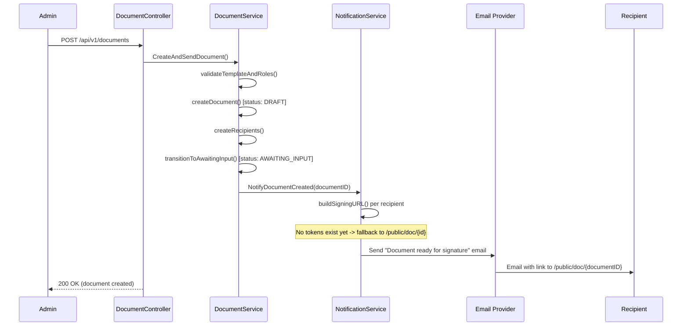
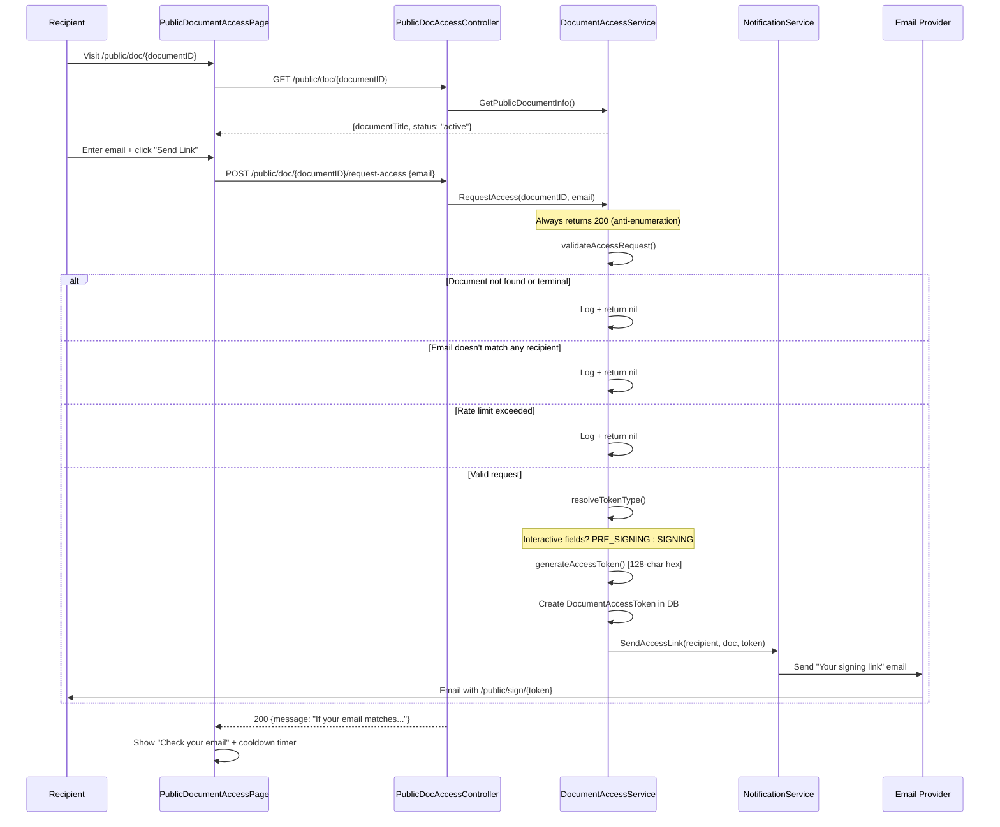
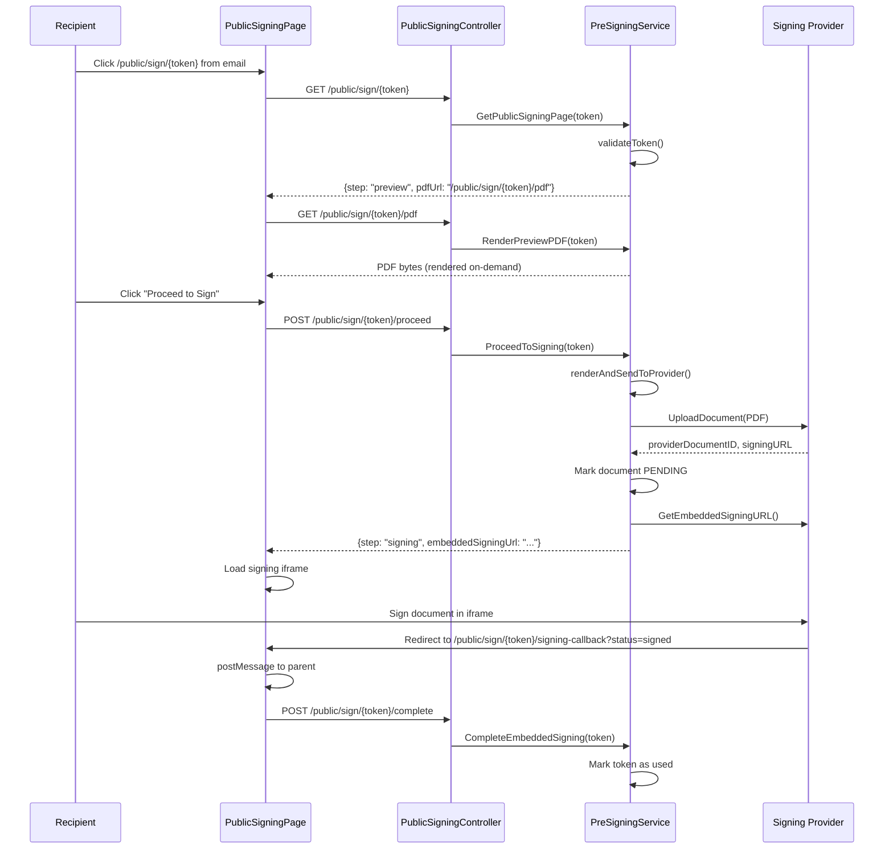
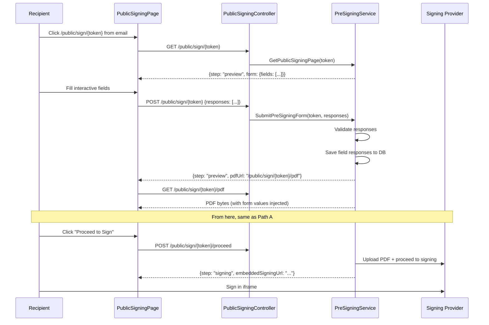
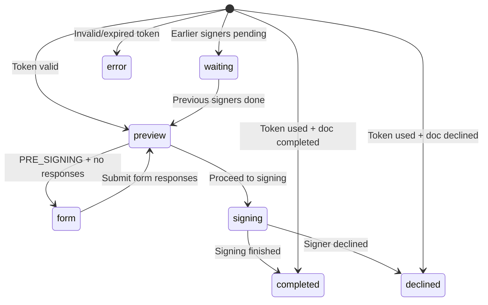
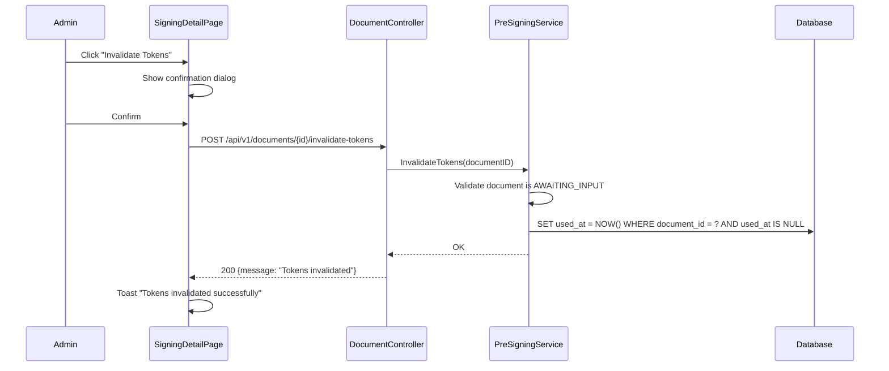

# Public Signing Flow

This document describes the complete flow for public document signing, from document creation through email verification to digital signature completion.

## Table of Contents

- [Overview](#overview)
- [Architecture](#architecture)
- [Flow 1: Document Creation](#flow-1-document-creation)
- [Flow 2: Email Verification Gate](#flow-2-email-verification-gate)
- [Flow 3: Token-Based Signing](#flow-3-token-based-signing)
- [Flow 4: Admin Token Invalidation](#flow-4-admin-token-invalidation)
- [Endpoints Reference](#endpoints-reference)
- [Security](#security)
- [Configuration](#configuration)

---

## Overview

Documents use a **single shared public URL** per document instead of per-recipient signing URLs. Recipients visit the public URL, verify their email, receive a token-based signing link, and proceed through the signing flow.

```
Create Document
  -> Notify recipients (email with /public/doc/{id})
    -> Recipient visits public URL
      -> Enters email -> Receives token link via email
        -> Accesses /public/sign/{token}
          -> Path A: PDF preview -> Sign (no interactive fields)
          -> Path B: Fill form -> PDF preview -> Sign (interactive fields)
```

There are two signing paths based on whether the document template has interactive fields:

| Path | Token Type | Interactive Fields | Flow |
|------|-----------|-------------------|------|
| **A** | `SIGNING` | No | Preview PDF -> Proceed to signing provider |
| **B** | `PRE_SIGNING` | Yes | Fill form -> Preview PDF -> Proceed to signing provider |

---

## Architecture

### High-Level Flow



### Component Map

```
Controller Layer                    Service Layer                    Repository Layer
---------------------              -------------------              ------------------
PublicDocAccessCtrl  ------------> DocumentAccessService ----------> DocumentRepository
  GET  /public/doc/:id                GetPublicDocumentInfo          DocumentRecipientRepo
  POST /public/doc/:id/request-access RequestAccess                  DocumentAccessTokenRepo
                                        |                            TemplateVersionRepo
                                        v
                                   NotificationService
                                        SendAccessLink
                                        NotifyDocumentCreated

PublicSigningCtrl  ----------------> PreSigningService -------------> DocumentRepository
  GET  /public/sign/:token             GetPublicSigningPage           DocumentAccessTokenRepo
  POST /public/sign/:token             SubmitPreSigningForm           FieldResponseRepo
  POST /public/sign/:token/proceed     ProceedToSigning               SigningProvider
  GET  /public/sign/:token/pdf         RenderPreviewPDF               PDFRenderer
  POST /public/sign/:token/complete    CompleteEmbeddedSigning
  GET  /public/sign/:token/refresh     RefreshEmbeddedURL

DocumentCtrl (authenticated) -----> PreSigningService
  POST /api/v1/documents/:id/         InvalidateTokens
       invalidate-tokens
```

---

## Flow 1: Document Creation

When an admin creates a document, the system notifies all recipients with the public document URL.



**Key files:**
- `core/internal/core/service/document/document_service.go` — `CreateAndSendDocument()`
- `core/internal/core/service/document/notification_service.go` — `NotifyDocumentCreated()`, `buildSigningURL()`
- `core/internal/core/service/document/templates/signing_request.html` — email template

---

## Flow 2: Email Verification Gate

The public document page acts as an email verification gate. Recipients enter their email, and if it matches a document recipient, a token is generated and sent via email.



**Key files:**
- `core/internal/core/service/document/document_access_service.go` — `RequestAccess()`, `validateAccessRequest()`, `generateAndSendToken()`
- `core/internal/adapters/primary/http/controller/public_document_access_controller.go` — routes
- `core/internal/core/service/document/templates/access_link.html` — email template
- `app/src/features/public-signing/components/PublicDocumentAccessPage.tsx` — frontend

---

## Flow 3: Token-Based Signing

After receiving the token URL via email, the recipient accesses the signing page. The flow depends on the token type.

### Path A: Direct Signing (SIGNING token, no interactive fields)



### Path B: Form + Signing (PRE_SIGNING token, interactive fields)



### Signing Page States



**Key files:**
- `core/internal/core/service/document/pre_signing_service.go` — all signing methods
- `core/internal/adapters/primary/http/controller/public_signing_controller.go` — routes
- `app/src/features/public-signing/components/PublicSigningPage.tsx` — frontend

---

## Flow 4: Admin Token Invalidation

Administrators can invalidate all active tokens for a document. Recipients with invalidated tokens cannot access the signing page and must request a new token via the email verification gate.



After invalidation, the recipient can still access `/public/doc/{documentID}` and request a new token via email.

**Key files:**
- `core/internal/core/service/document/pre_signing_service.go` — `InvalidateTokens()`
- `core/internal/adapters/primary/http/controller/document_controller.go` — route registration
- `app/src/features/signing/components/SigningDetailPage.tsx` — admin UI

---

## Endpoints Reference

### Public Endpoints (No Authentication)

| Method | Path | Purpose |
|--------|------|---------|
| `GET` | `/public/doc/{documentId}` | Get document info (title, status) |
| `POST` | `/public/doc/{documentId}/request-access` | Request access link (email verification) |
| `GET` | `/public/sign/{token}` | Get signing page state |
| `POST` | `/public/sign/{token}` | Submit pre-signing form (Path B) |
| `POST` | `/public/sign/{token}/proceed` | Render PDF + upload to provider |
| `GET` | `/public/sign/{token}/pdf` | Render PDF preview (on-demand) |
| `POST` | `/public/sign/{token}/complete` | Mark token as used after signing |
| `GET` | `/public/sign/{token}/refresh` | Refresh expired embedded URL |
| `GET` | `/public/sign/{token}/signing-callback` | Callback bridge (postMessage to parent) |

### Authenticated Endpoints

| Method | Path | Role | Purpose |
|--------|------|------|---------|
| `POST` | `/api/v1/documents` | Operator | Create document + send notifications |
| `POST` | `/api/v1/documents/{id}/invalidate-tokens` | Operator | Invalidate all active tokens |

---

## Security

### Anti-Email Enumeration

`POST /public/doc/{id}/request-access` **always returns HTTP 200** regardless of whether the email matches a recipient. Attackers cannot determine valid email addresses.

### Rate Limiting

Token generation is rate-limited per document + recipient pair. If the limit is exceeded, the request silently succeeds (HTTP 200) without generating a token.

| Config | Default | Description |
|--------|---------|-------------|
| `rate_limit_max` | 3 | Max tokens per window |
| `rate_limit_window_min` | 60 | Window duration (minutes) |

### Token Security

- **Random**: 64 cryptographic random bytes, hex-encoded (128 characters)
- **Single-use**: marked with `used_at` timestamp after signing completion
- **Expiring**: configurable TTL (default 48 hours)
- **Database-backed**: no client-side state or cookies

### Signing Order

Multi-signer documents enforce signing order. If earlier signers haven't signed, the current signer sees a "waiting" state with their position in the queue.

---

## Configuration

Signing access settings in `core/settings/app.yaml`:

```yaml
public_access:
  rate_limit_max: 3            # Max token requests per window
  rate_limit_window_min: 60    # Rate limit window (minutes)
  token_ttl_hours: 48          # Token expiration (hours)
```

Environment variable overrides:

| Variable | Description |
|----------|-------------|
| `DOC_ENGINE_PUBLIC_ACCESS_RATE_LIMIT_MAX` | Max token requests per window |
| `DOC_ENGINE_PUBLIC_ACCESS_RATE_LIMIT_WINDOW_MIN` | Rate limit window in minutes |
| `DOC_ENGINE_PUBLIC_ACCESS_TOKEN_TTL_HOURS` | Token TTL in hours |
