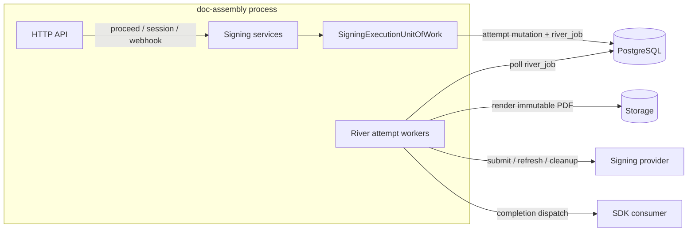
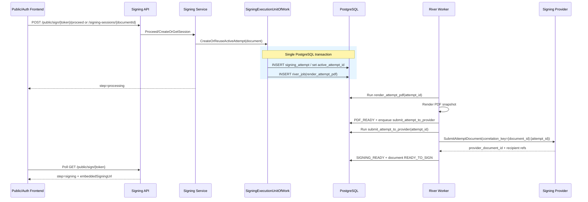
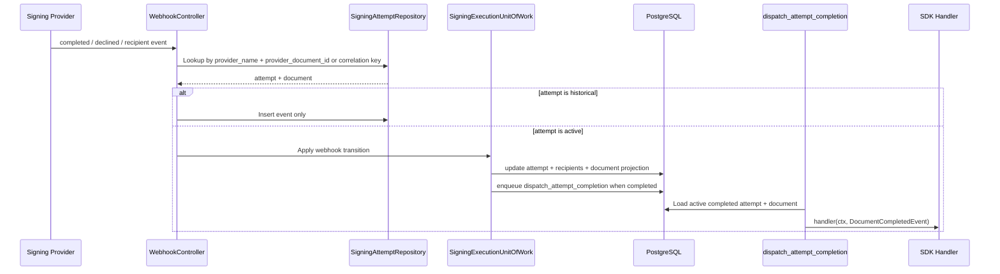

# Worker Queue Guide — Signing Attempts + River

Background job processing for signing attempts using [River](https://riverqueue.com), a PostgreSQL-native job queue for Go.

River is the only durable execution engine for signing side effects. The business document row is a projection; the technical execution source of truth is `execution.signing_attempts`.

## Architecture Overview

River runs inside the same Go process as the API server, sharing the PostgreSQL connection pool. No external broker (Redis, RabbitMQ) is needed.



## Source of Truth

| Concept | Owner |
|---|---|
| Current business state visible to users | `execution.documents.status` |
| Active technical execution | `execution.documents.active_attempt_id` |
| Render/provider/retry/reconciliation state | `execution.signing_attempts` |
| Signer provider references and embedded URLs | `execution.signing_attempt_recipients` |
| Attempt audit trail and webhook history | `execution.signing_attempt_events` |
| Durable async execution | `river_job` |

`Document` status is recomputed from the active attempt only. Superseded or invalidated historical attempts can record events, but they must not mutate the active document projection.

## Attempt Jobs

All signing jobs carry `attempt_id` and are unique by attempt + phase (`ByArgs` + 24h):

| Job kind | Purpose |
|---|---|
| `render_attempt_pdf` | Render immutable pre-signed PDF for one attempt. |
| `submit_attempt_to_provider` | Submit the stored PDF snapshot to the signing provider. |
| `reconcile_provider_submission` | Resolve ambiguous provider submission outcome by correlation key when supported. |
| `refresh_attempt_provider_status` | Refresh provider status/signing references for an active attempt. |
| `cleanup_provider_attempt` | Best-effort cancellation/cleanup for superseded provider documents. |
| `dispatch_attempt_completion` | Build and deliver the SDK `DocumentCompletedEvent` for the active completed attempt. |

## Public/Auth Proceed Flow

`ProceedToSigning` does not render or upload inline. It creates or reuses the active attempt and lets River advance the phases.



## Transactional Boundaries

Each durable transition that schedules follow-up work happens in one PostgreSQL transaction:

| Transition | Same-transaction enqueue |
|---|---|
| Attempt created/reused | `render_attempt_pdf` |
| PDF rendered and stored | `submit_attempt_to_provider` |
| Provider result ambiguous | `reconcile_provider_submission` |
| Active attempt completed | `dispatch_attempt_completion` |
| Attempt superseded after provider submit | `cleanup_provider_attempt` |

This prevents states such as “PDF_READY but no submit job” or “COMPLETED but no completion dispatch”.

## Provider Failure Handling

Provider operations cannot be part of the local DB transaction, so errors are classified and persisted on the attempt:

| Error class | State behavior |
|---|---|
| `TRANSIENT` | Persist retryable state and let River retry the same attempt. |
| `PERMANENT` | Mark attempt `FAILED_PERMANENT`; document projection becomes `ERROR` if active. |
| `AMBIGUOUS` | Mark `SUBMISSION_UNKNOWN` and enqueue reconciliation. |
| `CONFLICT_STALE` | Mark `REQUIRES_REVIEW` or safe no-op for stale/historical work. |

Reconciliation uses the provider correlation key when supported. If the provider cannot reconcile, the attempt eventually moves to `REQUIRES_REVIEW` rather than creating duplicate provider documents.

## Webhook and Completion Dispatch



The dispatch worker always verifies `document.active_attempt_id == attempt_id` before invoking the SDK handler. Stale completion jobs complete as no-ops.

## Document Projection

| Active attempt status | Document status |
|---|---|
| `CREATED`, `RENDERING`, `READY_TO_SUBMIT`, `SUBMITTING_PROVIDER`, `PROVIDER_RETRY_WAITING`, `SUBMISSION_UNKNOWN` | `PREPARING_SIGNATURE` |
| `SIGNING_READY` | `READY_TO_SIGN` |
| `SIGNING` | `SIGNING` |
| `COMPLETED` | `COMPLETED` |
| `DECLINED` | `DECLINED` |
| `FAILED_PERMANENT`, `REQUIRES_REVIEW` | `ERROR` |
| `SUPERSEDED`, `INVALIDATED`, `CANCELLED` | Historical only; must not project unless active by mistake. |

## Public Page States

The public signing page exposes user-safe steps, not internal attempt statuses:

| Step | Meaning |
|---|---|
| `preview` | Show form or PDF preview before signing starts. |
| `processing` | Active attempt is being rendered/submitted/reconciled by River. |
| `signing` | Provider signing URL is ready for the token recipient. |
| `waiting` | Earlier signer must sign first. |
| `completed` | Document completed; signed PDF may be downloadable. |
| `declined` | Document declined. |
| `document_updated` | Token is bound to an old/superseded attempt; user must use a fresh document link. |
| `unavailable` | Active attempt failed permanently or requires review. |

## Configuration

In `settings/app.yaml`:

```yaml
worker:
  enabled: false              # DOC_ENGINE_WORKER_ENABLED
  max_workers: 10             # DOC_ENGINE_WORKER_MAX_WORKERS
  runtime_environment: local  # DOC_ENGINE_WORKER_RUNTIME_ENVIRONMENT
  failpoints_enabled: false   # DOC_ENGINE_WORKER_FAILPOINTS_ENABLED
  failpoints: []              # DOC_ENGINE_WORKER_FAILPOINTS
```

| Variable | Default | Description |
|---|---|---|
| `DOC_ENGINE_WORKER_ENABLED` | `false` | Starts River workers when true. When false, jobs can still be inserted transactionally but are not processed. |
| `DOC_ENGINE_WORKER_MAX_WORKERS` | `10` | Max concurrent worker goroutines for the default queue. |
| `DOC_ENGINE_WORKER_RUNTIME_ENVIRONMENT` | `local` | Runtime guard for worker behavior. Production disables failpoints. |
| `DOC_ENGINE_WORKER_FAILPOINTS_ENABLED` | `false` | Enables non-production signing attempt failure injection. Ignored in production/prod. |
| `DOC_ENGINE_WORKER_FAILPOINTS` | empty | CSV failpoint names for live development/test validation. |

Supported non-production failpoints:

- `render.before`
- `render.after_store_before_commit`
- `submit.before_provider`
- `submit.corrupt_pdf_checksum`
- `submit.after_provider_accepted_before_commit`
- `cleanup.fail`

## SDK Types

The SDK completion handler remains document-level, but dispatch is attempt-aware internally:

```go
import "github.com/rendis/doc-assembly/core/sdk"

handler := func(ctx context.Context, ev sdk.DocumentCompletedEvent) error {
    log.Printf("Document %s completed in tenant %s", ev.DocumentID, ev.TenantCode)
    for _, r := range ev.Recipients {
        log.Printf("  %s (%s) signed at %v", r.Name, r.RoleName, r.SignedAt)
    }
    return nil // return error to retry dispatch_attempt_completion
}
```

### DocumentCompletedEvent Fields

| Field | Type | Description |
|---|---|---|
| `DocumentID` | `string` | UUID of the completed document. |
| `ExternalID` | `*string` | Client-provided external reference (nullable). |
| `Title` | `*string` | Document title (nullable). |
| `Status` | `DocumentStatus` | Always `COMPLETED`. |
| `WorkspaceCode` | `string` | Workspace code. |
| `TenantCode` | `string` | Tenant code. |
| `Environment` | `Environment` | Document environment. |
| `CreatedAt` | `time.Time` | Document creation timestamp. |
| `UpdatedAt` | `*time.Time` | Last update timestamp. |
| `ExpiresAt` | `*time.Time` | Expiration timestamp (nullable). |
| `Metadata` | `map[string]string` | Client metadata. |
| `Recipients` | `[]CompletedRecipient` | All signers with role and status. |

### CompletedRecipient Fields

| Field | Type | Description |
|---|---|---|
| `RoleName` | `string` | Signer role name from template. |
| `SignerOrder` | `int` | Signing order (1-based). |
| `Name` | `string` | Recipient full name. |
| `Email` | `string` | Recipient email. |
| `Status` | `RecipientStatus` | Always `SIGNED` for completed docs. |
| `SignedAt` | `*time.Time` | Signing timestamp. |

## Package Structure

```text
core/internal/infra/riverqueue/
├── args.go                 # Attempt-scoped job args and job kinds
├── client.go               # RiverService lifecycle and worker registration
├── uow.go                  # SigningExecutionUnitOfWork + river.InsertTx
├── attempt_workers.go      # River worker types
├── executor.go             # Attempt phase execution logic
├── failpoints.go           # Dev/test failure injection
├── helpers.go              # Shared attempt worker helpers
├── scan.go                 # River/pgx scan helpers
├── notifier.go             # Documents removal of the legacy document-level notifier
├── worker.go               # Attempt-aware completion event builder/helpers
└── river_integration_test.go

core/internal/core/port/
├── signing_execution_uow.go
├── signing_attempt_repository.go
└── document_completion.go

core/internal/adapters/secondary/database/postgres/signing_attempt_repo/
└── repo.go / queries.go
```

## Integration Tests

Located at `internal/infra/riverqueue/river_integration_test.go`. Run with:

```bash
go test -C core -tags=integration -run TestRiver -v -count=1 ./internal/infra/riverqueue/
```

Coverage includes:

| Area | What it validates |
|---|---|
| Atomic enqueue | Attempt creation/state transition and River job insertion commit or roll back together. |
| Concurrency | Concurrent `ProceedToSigning` creates/reuses one active attempt. |
| Constraints | `active_attempt_id` must belong to the same document; provider document/correlation keys are unique. |
| Deduplication | Same `attempt_id + phase` does not duplicate jobs. |
| Regeneration | Superseding an attempt enqueues cleanup for old provider state. |
| Stale work | Historical completion dispatch and late webhook do not mutate active document projection. |
| Failpoints | Render, submit, ambiguous provider result, corrupt PDF checksum, cleanup failure, and restart-safe states. |
| Completion | Active completed attempt dispatches the SDK event through River. |

## Database Tables

River manages its own tables (auto-migrated on startup):

- `river_job` — Job queue with args (JSONB), state, attempt count.
- `river_migration` — Schema version tracking.

Signing attempts live in the application schema:

- `execution.signing_attempts`
- `execution.signing_attempt_recipients`
- `execution.signing_attempt_events`
