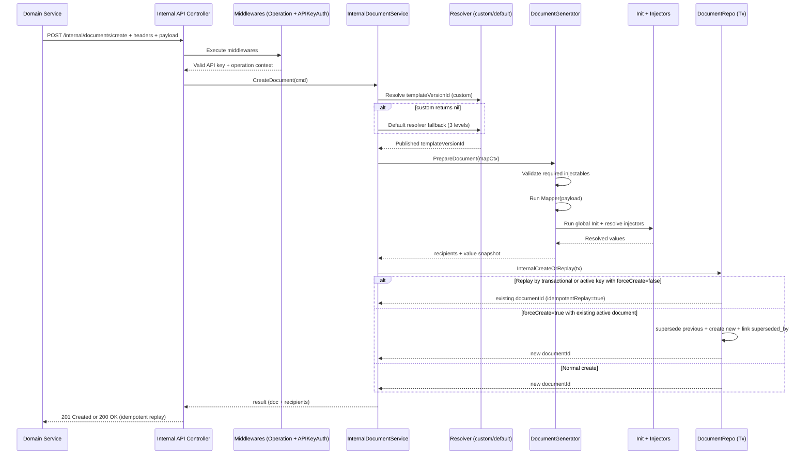

# Flow 2: Document Creation via Internal API

## Objective

Document the document creation flow from a domain service to `POST /api/v1/internal/documents/create`, including middlewares, template version resolution, mapper/init/injectors, and concurrency/idempotency controls.

## Endpoint and Contract

- Method: `POST`
- Path: `/api/v1/internal/documents/create`
- Auth: `X-API-Key` (service-to-service)
- Required headers:
  - `X-Tenant-Code`
  - `X-Workspace-Code`
  - `X-Document-Type`
  - `X-External-ID`
  - `X-Transactional-ID`
- Custom headers: accepted and propagated to mapper/injector context.
- Body (current v1):

```json
{
  "forceCreate": false,
  "supersedeReason": "optional",
  "payload": {
    "fieldA": "value",
    "fieldB": 123
  }
}
```

`payload` is required (not empty / not `null`) and is passed to mapper as `RawBody`.

## Flow Characteristics

1. Uses `X-API-Key` + business codes (`tenant`, `workspace`, `document type`) to resolve context.
2. Runs internal API middlewares: `Operation` + `APIKeyAuth`.
3. Uses a single registered mapper and a single global init function.
4. Resolves `templateVersionId` (custom resolver + default fallback) before mapper/init/injectors.
5. Includes transactional persistence with idempotency and concurrency controls.

## Execution Order (Backend)

1. `Operation` middleware (operation ID / tracing).
2. `APIKeyAuth` middleware (`X-API-Key`).
3. Controller:
   - validates required headers;
   - validates body and `payload`;
   - builds `InternalCreateCommand` (includes all headers and raw `payload`).
4. `InternalDocumentService`:
   - resolves context by codes: tenant, workspace, document type;
   - executes custom template version resolver (if present);
   - applies default resolver fallback if custom returns `nil`;
   - validates that resolved version is published and consistent with document type/template.
5. `DocumentGenerator.PrepareDocument`:
   - fetches workspace available injectables;
   - validates that injectables referenced by the version are available;
   - runs mapper (over `payload`);
   - runs global `Init` (if present);
   - resolves injectors;
   - builds recipients from signer roles + resolved values.
6. Builds `Document` with resolved injected values snapshot.
7. Transactional persistence with `InternalCreateOrReplay`:
   - replay by `workspace_id + transactional_id`;
   - replay/supersede by active logical key (`workspace_id + document_type_id + external_id`);
   - `forceCreate=false`: replay active document;
   - `forceCreate=true`: supersede active document + create new document.
8. Loads persisted document with recipients and returns:
   - `201 Created` if actual creation happened;
   - `200 OK` if idempotent replay happened.

## Template Version Resolution

### Custom resolver

- If registered and returns `versionID`: that one is used.
- If it returns `nil`: default fallback applies.
- If it returns error: operation aborts.

### Default fallback (3 levels)

1. requested `tenant + workspace`.
2. `tenant + SYS_WRKSP`.
3. `SYS + SYS_WRKSP`.

Published version is always required.

## Concurrency and Idempotency Controls

Repository layer uses several defenses:

1. `pg_advisory_xact_lock` by composed key `workspace|externalId|documentTypeId`.
2. `SELECT ... FOR UPDATE` for replay by `transactional_id`.
3. `SELECT ... FOR UPDATE` for active document by logical key.
4. Unique constraints in DB:
   - `uq_documents_workspace_transactional_id`:
     `UNIQUE (workspace_id, transactional_id)`.
     Applies when a record has a non-null `transactional_id` and prevents creating two documents in the same workspace with the same transactional identifier.
   - `uq_documents_active_logical_key`:
     partial unique index on
     `(workspace_id, client_external_reference_id, document_type_id)`
     with condition
     `WHERE is_active = TRUE AND client_external_reference_id IS NOT NULL`.
     Applies only to active documents with a defined external reference and guarantees a single active document per logical key.
5. Post-conflict recovery:
   - on constraint violation, it fetches existing document and returns idempotent replay response.

## Sequence Diagram



## Important Notes

- This endpoint does not use JWT `Authorization` or `X-Tenant-ID`/`X-Workspace-ID`; it uses business codes + `X-API-Key`.
- `payload` is passed to mapper as an isolated block, not the full body.
- Initial document state may end up as `DRAFT` or `AWAITING_INPUT` depending on resolved recipients/signer roles.
