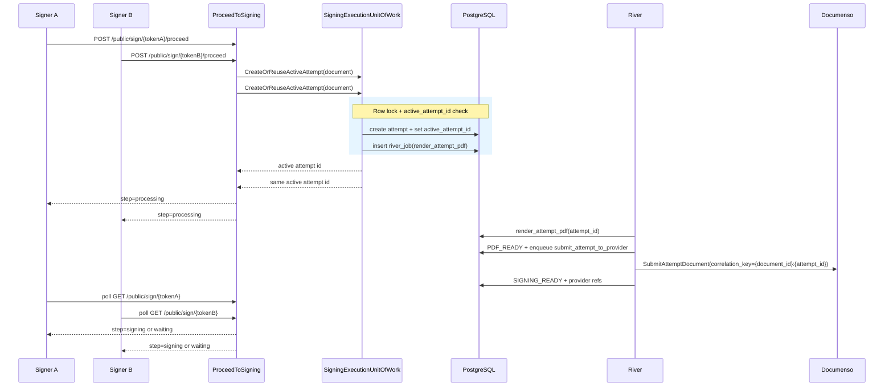
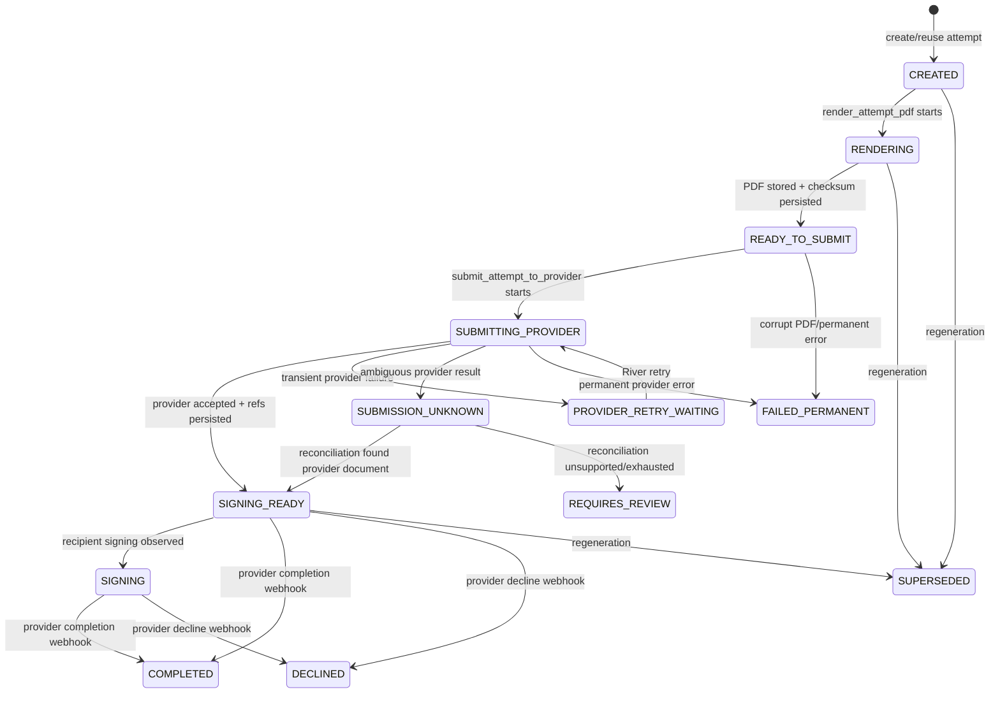
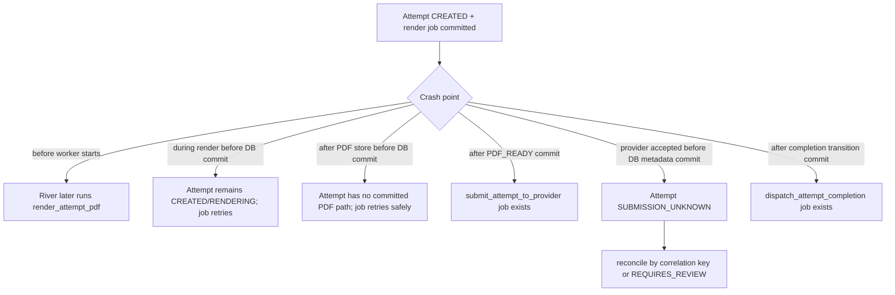

# ProceedToSigning Concurrency Control

## Current Model

`ProceedToSigning` is now attempt-scoped and River-orchestrated.

The public or authenticated request path does **not** render the final signing PDF and does **not** upload to the provider inline. It creates or observes the document's active `SigningAttempt`, transactionally enqueues River work, and returns `step: "processing"` until the active attempt reaches a user-visible state.

`execution.documents` is only the business projection. Technical signing state lives in:

- `execution.signing_attempts`
- `execution.signing_attempt_recipients`
- `execution.signing_attempt_events`
- `river_job`

There is no `PENDING_PROVIDER` state, no document-level provider retry loop, and no pending-provider scheduler fallback.

## Race Being Prevented

When multiple users or browser tabs call `ProceedToSigning` at the same time for the same document, only one active attempt must be created and only one provider document should be submitted for that attempt.



## Concurrency Guarantees

| Guarantee | Mechanism |
|---|---|
| Single active attempt per document | Transactional `CreateOrReuseActiveAttempt` under PostgreSQL row-level locking. |
| No duplicate phase jobs for same attempt | River uniqueness by `attempt_id + phase` (`ByArgs` + 24h). |
| Regeneration is isolated | New attempt ID means new River job keys; old jobs are stale and must no-op. |
| Provider idempotency | Provider correlation key is `{document_id}:{attempt_id}` and is unique in DB. |
| Late webhook safety | Webhook for non-active attempt records event only; document projection is not mutated. |
| Crash recovery | Last durable attempt state determines which River phase retries or reconciles. |

## State Flow



Document projection from the active attempt:

```text
preparing attempt statuses -> PREPARING_SIGNATURE
SIGNING_READY              -> READY_TO_SIGN
SIGNING                    -> SIGNING
COMPLETED                  -> COMPLETED
DECLINED                   -> DECLINED
FAILED_PERMANENT/REVIEW    -> ERROR
```

Historical attempts (`SUPERSEDED`, `INVALIDATED`, `CANCELLED`) are audit records and do not control the document projection.

## Crash Recovery



The safe rule is: River resumes from committed PostgreSQL state. Provider side effects are tied back using provider document ID and correlation key.

## Public UX Under Concurrency

The frontend should not expose internal attempt states. It maps them to stable public steps:

| Public step | When returned |
|---|---|
| `processing` | Active attempt is rendering, submitting, retrying, or reconciling. |
| `signing` | Provider signing reference is ready for this recipient. |
| `waiting` | Multi-signer ordering blocks this recipient. |
| `document_updated` | Token points at an old/superseded attempt. |
| `unavailable` | Active attempt is failed permanently or requires manual review. |

## Implementation Files

| File | Responsibility |
|---|---|
| `core/internal/core/service/document/pre_signing_service.go` | Public token flow; creates/reuses active attempts; maps attempts to public steps. |
| `core/internal/core/service/document/signing_session_service.go` | Authenticated signing session bootstrap; no provider upload outside attempts/River. |
| `core/internal/core/port/signing_execution_uow.go` | Transactional signing execution operations. |
| `core/internal/infra/riverqueue/uow.go` | PostgreSQL transactions + `river.InsertTx`. |
| `core/internal/infra/riverqueue/attempt_workers.go` | River worker registrations for attempt phases. |
| `core/internal/infra/riverqueue/executor.go` | Render, submit, retry, reconciliation, cleanup, and completion dispatch execution. |
| `core/internal/adapters/secondary/database/postgres/signing_attempt_repo/` | Attempt persistence and constraints. |
| `app/src/features/public-signing/components/PublicSigningPage.tsx` | Polling and user-safe public states. |
| `app/src/features/public-signing/types.ts` | Public step type union. |

## Validation

The clean-slate implementation was validated with:

- Unit tests for projection and stale/no-op behavior.
- PostgreSQL/River integration tests for single active attempt, constraints, transactional enqueue, deduplication, supersede cleanup, and stale completion dispatch.
- Failpoint-driven live scenarios for render failure, PDF checksum failure, transient/ambiguous provider failures, stale jobs, late webhooks, cleanup failure, and restart-safe recovery.
- Live Documenso/public-signing E2E for direct `SIGNING` and form-first `PRE_SIGNING` through signed PDF download.

See: `docs/superpowers/evidence/2026-04-22-signing-attempts-river.md`.
