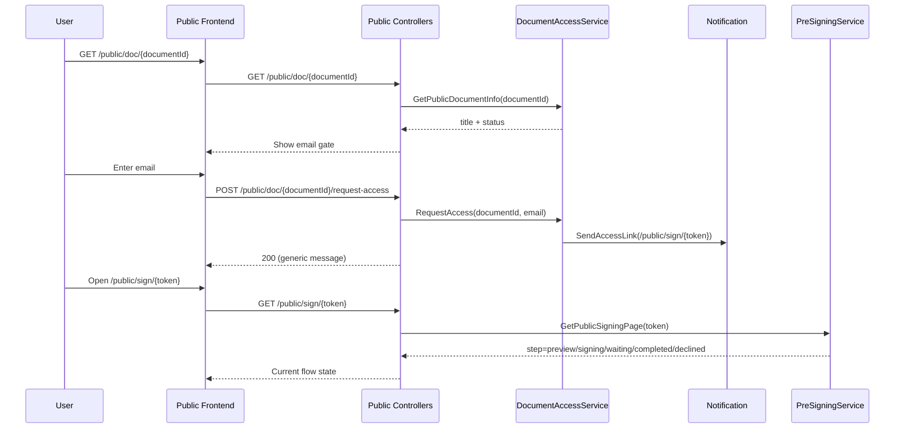
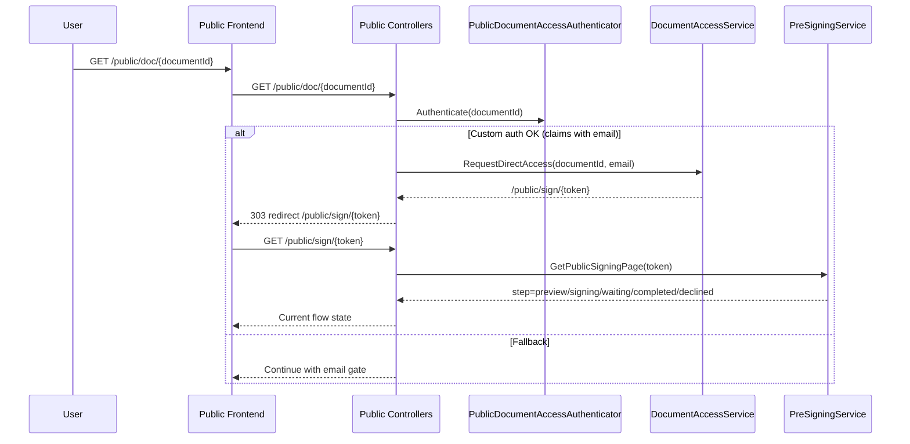
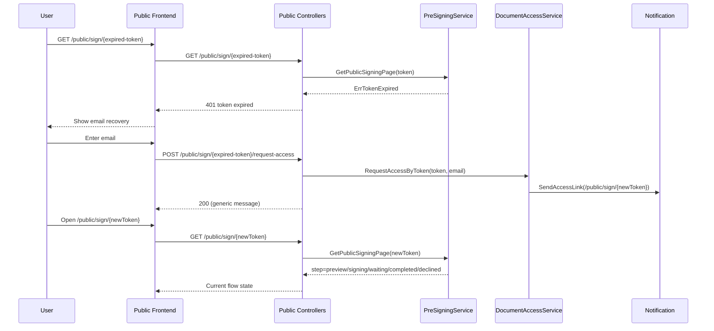

# Public Signing Flow

## Objective

Document the public document access and signing flow, including:

- public document URL access (`/public/doc/{documentId}`)
- tokenized link access (`/public/sign/{token}`)
- optional custom domain-auth bypass
- expired magic link recovery

## Involved Endpoints

- `GET /public/doc/{documentId}`
- `POST /public/doc/{documentId}/request-access`
- `GET /public/sign/{token}`
- `POST /public/sign/{token}`
- `POST /public/sign/{token}/proceed`
- `GET /public/sign/{token}/pdf`
- `GET /public/sign/{token}/download`
- `POST /public/sign/{token}/request-access`
- `POST /public/sign/{token}/complete`
- `GET /public/sign/{token}/refresh`

## Endpoints by Flow Domain

### Public

| Endpoint | Purpose | When it is used |
|---|---|---|
| `GET /public/doc/{documentId}` | Public entry point to the document (email gate) or custom-auth bypass. | First access from email/public channel using `documentId`. |
| `POST /public/doc/{documentId}/request-access` | Request magic link by email from the email gate. | User submitted email in access screen. |

### Tokenized Access

| Endpoint | Purpose | When it is used |
|---|---|---|
| `GET /public/sign/{token}` | Get signing state for a tokenized session. | Initial load/refresh of signing page. |
| `POST /public/sign/{token}` | Submit interactive pre-sign form (if present). | Path B (`PRE_SIGNING` token) with interactive fields. |
| `POST /public/sign/{token}/proceed` | Continue to embedded signing; renders PDF and uploads to provider when needed. | After PDF preview in Path A or Path B. |
| `GET /public/sign/{token}/pdf` | Render/get preview PDF on demand. | Preview before proceeding to sign. |
| `GET /public/sign/{token}/download` | Download final signed PDF. | Document completed and authorized recipient. |
| `POST /public/sign/{token}/request-access` | Access recovery for expired token/tokenized entry. | User with expired link requests a new email link. |
| `POST /public/sign/{token}/complete` | Mark token as used after embedded signing completion. | Frontend callback after iframe completion. |
| `GET /public/sign/{token}/refresh` | Get new embedded URL when current one expires. | Embedded iframe expires during signing. |
| `GET /public/sign/{token}/signing-callback` | HTML `postMessage` bridge between provider and parent UI. | Signature provider callback/redirection inside iframe. |

### Admin

| Endpoint | Purpose |
|---|---|
| `POST /api/v1/documents/{id}/invalidate-tokens` | Invalidate all active tokens for a document (force link reissue). |

## Flow 1: User Without Domain Authentication

1. User opens public URL: `/public/doc/{documentId}`.
2. Backend returns minimal public document info (title + public status).
3. Frontend asks user email.
4. User submits email to `/public/doc/{documentId}/request-access`.
5. If email/document/status are valid, backend generates token and sends `/public/sign/{token}` by email.
6. User opens `/public/sign/{token}`.
7. Depending on token type and document status:
   - `preview` (PDF or form),
   - `signing` (iframe),
   - `waiting`,
   - `completed`,
   - `declined`.
8. In `completed` state, frontend enables download only if `canDownload=true`.

## Flow 2: User With Custom Domain Authentication

1. User opens `/public/doc/{documentId}`.
2. Custom middleware (`PublicDocumentAccessAuthenticator`) evaluates access in `GET /public/doc/:documentId`.
3. If custom auth returns valid claims (with email), backend generates direct token (no email sent) and returns `303` redirect to `/public/sign/{token}`.
4. User goes directly into tokenized flow (`preview/signing/waiting/completed/declined`).
5. If custom auth does not apply, fails, or provides no useful claims, flow falls back to standard email gate (Flow 1).

## Flow 3: User With Expired Magic Link

1. User opens expired `/public/sign/{token}`.
2. Backend returns token expiration error.
3. Frontend shows email recovery screen.
4. User submits email to `POST /public/sign/{token}/request-access`.
5. Backend tries to resolve `documentId` from that token and, if valid, issues a new token by email.
6. User opens new `/public/sign/{newToken}` and continues normal flow.

## UI States in `/public/sign/{token}`

- `preview`:
  - Path A (`SIGNING` token): PDF preview and "proceed" action.
  - Path B (`PRE_SIGNING` token): interactive form and then PDF preview.
- `signing`: embedded iframe (or fallback URL when provider does not support embed).
- `waiting`: previous signers are still pending.
- `completed`: signing completed for document.
- `declined`: document was declined.

## Access and Download Rules

- A valid token allows navigating the signing flow.
- Expired token returns expiration error and enables email recovery.
- Used token:
  - can show terminal states (`completed`/`declined`);
  - is rejected for non-terminal states.
- Signed PDF download (`/download`) requires:
  - document in `completed` state,
  - and token recipient has signed.

## Flow Security Controls

- Anti-enumeration:
  - `POST /public/doc/{id}/request-access` and
  - `POST /public/sign/{token}/request-access`
  always return `200`, even if no link is generated.
- Access-link issuance rate limit by `document + recipient`.
- Custom middleware never blocks on its own: if it does not validate, flow falls back to email gate.

## Sequence Diagrams

### Public Flow (Email Gate)

### Custom Auth Flow (Bypass)

### Recovery Flow (Expired Token)

