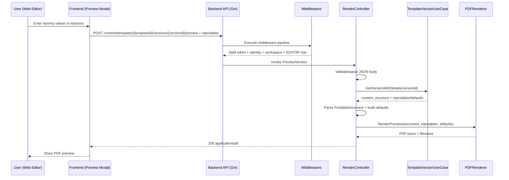

# Template Preview Flow

## Objective

Describe the PDF preview generation flow from the template editor (webApp), including frontend, middlewares, and backend.

## Involved Endpoint

- Method: `POST`
- Path: `/api/v1/content/templates/{templateId}/versions/{versionId}/preview`
- Body:

```json
{
  "injectables": {
    "variable_1": "dummy value",
    "variable_2": 123
  }
}
```

## Flow Summary

1. Frontend: user enters dummy values for injectors.
2. Frontend: request is sent with `versionId` (and `templateId` in URL) + `injectables`.
3. Backend: global and route middlewares run (auth/token, identity, workspace context, minimum `EDITOR` role).
4. Backend (controller): JSON payload is validated and the requested version is fetched.
5. Backend: content is parsed, defaults + injectables are merged, and PDF is rendered.
6. Backend: `application/pdf` (blob) is returned to frontend.

## Detailed Sequence

### Frontend

1. Opens preview modal.
2. Completes/edits dummy values for variables (including simulated values when applicable).
3. Executes `POST /content/templates/{templateId}/versions/{versionId}/preview` with `{ injectables }`.
4. Receives PDF blob and opens viewer modal.

### Backend

1. API middlewares:
   - `PanelAuth` (validates token/issuer/JWKS based on config)
   - `IdentityContext`
   - `SystemRoleContext`
2. Content middlewares:
   - `WorkspaceContext` (requires `X-Workspace-ID` + workspace access)
   - `SandboxContext` (if applicable)
   - `RequireEditor` (minimum editor role)
3. `PreviewVersion` controller:
   - Parses `injectables` from body (empty body is allowed).
   - Fetches version with `GetVersionWithDetails(versionId)`.
   - Parses `content_structure` to `PortableDocument`.
   - Builds `injectableDefaults`.
   - Calls `pdfRenderer.RenderPreview(...)`.
4. Returns binary PDF with headers:
   - `Content-Type: application/pdf`
   - `Content-Disposition: attachment; filename="..."`

## Sequence Diagram



## Technical Considerations

Currently, `PreviewVersion` uses `versionId` to fetch the version and does not explicitly validate in that controller that route `templateId` matches that version. Current access control is mainly handled by middlewares (auth + workspace + role).
